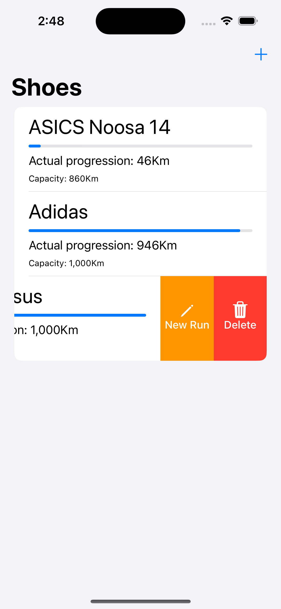
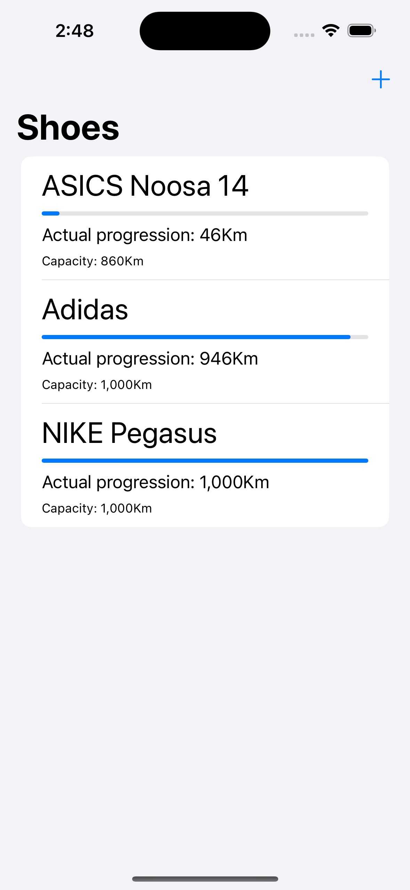
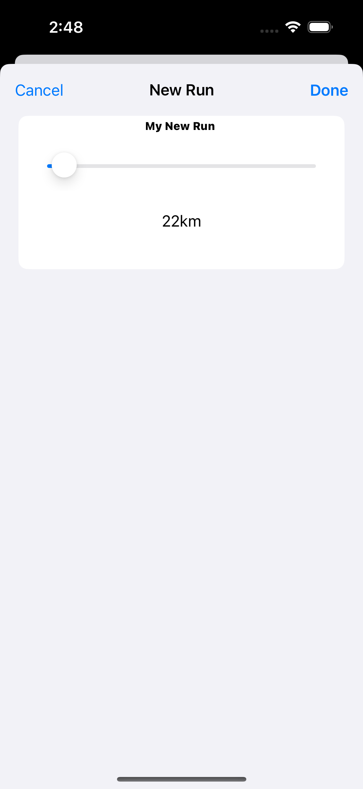

#  Runner App

- App for the serious Runner who want to track the kilometers progression of their shoes.
-`Download Here [FitSafe](https://apps.apple.com/us/app/fitsafe/id1673039363) !`

## Technologies Used
- Swift
- SwiftUI
- CoreData

- Managed CoreData manually with entity to save, delete, persist and update the data.
- ProgressionView to see the progression and the capacity left.
- MVVM design partern.

